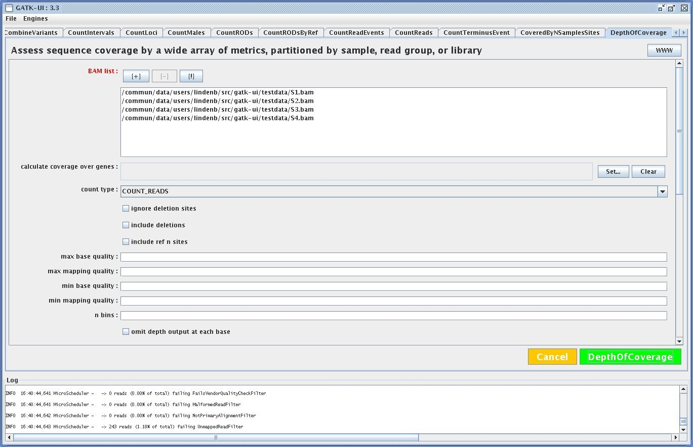

Java Swing Interface for the Genome Analysis Toolkit (GATK) https://www.broadinstitute.org/gatk/

## Screenshot



## Compilation

Requirements:

   * GNU make >= 3.81
   * java JDK 1.7
   * xsltproc

Tested with **GATK 3.3** .

Create a new file `local.mk` (in the `Makefile` directory) containing a property **gatk.jar** defining the path to the GATK jar.

```make
gatk.jar=/dir1/dir2/GenomeAnalysisTK.jar
```

Then run 

```bash
$ make
```

To run GATK-UI, type

```bash
$ make run 
```

or run the executable jar:

```bash
$ java -jar path/to/gatk-ui/dist/gatk-ui.jar 
```


## Questions

## Why did you create this tool ?

Some non-bioinformatician collaborators often want some coverage data for a defined set of BAM, for a specific region...


## Did you test every tool ?

NO

### How did you create an interface for each GATK tool ?

Each tool in the GATK is documented in a web page: https://www.broadinstitute.org/gatk/gatkdocs/org_broadinstitute_gatk_tools_walkers_variantutils_SelectVariants.php and
each web page is associated to a structured **JSON** page https://www.broadinstitute.org/gatk/gatkdocs/org_broadinstitute_gatk_tools_walkers_variantutils_SelectVariants.php.json

```json
{
  "summary": "Select a subset of variants from a larger callset",
  "parallel": [
    {
      "arg": "-nt",
      "link": "http://www.broadinstitute.org/gatk/guide/tooldocs/org_broadinstitute_gatk_engine_CommandLineGATK.php#-nt",
      "name": "TreeReducible"
    }
  ],
  "activeregion": {},
```
This json is transformed to XML in order to process it with **XSLT** . A XSLT stylesheet generates some java code

## How can I add a new tool ?

add a tool package to the property **gatk.docs** in the Makefile.


## Deploying as a JNLP application

In `local.mk` add the following properties:

```make
## where to install the tool 
jnlp.dir=/var/www/pages/gatk-ui/
## a password for jarsigner
key.password=mypassword
## base url
jnlp.baseurl=http://localhost/gatk-ui/
```

Then run:

```bash
$ make jnlp
```

The application will be available at ${jnlp.baseurl}/gatk-ui.jnlp

## History

* 2015-12-26: removed some deprecated tools.


## Author

* Pierre Lindenbaum PhD http://twitter.com/yokofakun Institut du Thorax, 44000 Nantes.

## See also

  * https://www.broadinstitute.org/gatk/

## Report bugs / Contribute

  * https://github.com/lindenb/gatk-ui/issues

### License

  * MIT License


